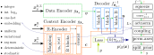

[](https://paperswithcode.com/sota/time-series-anomaly-detection-on-atms-fault?p=contextflow-generalist-specialist-flow-based)
[](https://paperswithcode.com/sota/unsupervised-anomaly-detection-on-smap?p=contextflow-generalist-specialist-flow-based)

# ContextFlow++: Generalist-Specialist Flow-based Generative Models with Mixed-Variable Context Encoding

## Abstract
Normalizing flow-based generative models have been widely used in applications where the exact density estimation is of major importance. Recent research proposes numerous methods to improve their expressivity. 
However, conditioning on a context is largely overlooked area in the bijective flow research. Conventional conditioning with the vector concatenation is limited to only a few flow types. 
More importantly, this approach cannot support a practical setup where a set of context-conditioned (*specialist*) models are trained with the fixed pretrained general-knowledge (*generalist*) model.

We propose ContextFlow++ approach to overcome these limitations using an additive conditioning with explicit generalist-specialist knowledge decoupling. Furthermore, we support discrete contexts by the proposed mixed-variable architecture with context encoders. Particularly, our context encoder for discrete variables is a surjective flow from which the context-conditioned continuous variables are sampled. Our experiments on rotated MNIST-R, corrupted CIFAR-10C, real-world ATM predictive maintenance and SMAP unsupervised anomaly detection benchmarks show that the proposed ContextFlow++ offers faster stable training and achieves higher performance metrics.

## BibTex Citation
If you like our [UAI24 paper](https://arxiv.org/abs/2406.00578) or code, please cite it using the following BibTex:
```
@inproceedings{contextflow,
	title = {ContextFlow++: Generalist-Specialist Flow-based Generative Models with Mixed-Variable Context Encoding},
	author = {Gudovskiy, Denis and Okuno, Tomoyuki and Nakata, Yohei},
	booktitle = {Proceedings of the Conference on Uncertainty in Artificial Intelligence (UAI)},
	year = {2024}
}
```

## Installation
- Clone this repository: tested on Python 3.8
- Install [PyTorch](http://pytorch.org/): tested on v2.X
- Other dependencies in requirements.txt

Install all packages with these commands:
```
conda create -n contextflow python=3.8 -y
conda activate contextflow
conda install pytorch torchvision pytorch-cuda=12.1 -c pytorch -c nvidia
python -m pip install -U -r requirements.txt
ln -s ~/PATHTO/data data
cd contextflow
```

## Datasets
- MNIST-R and CIFAR-10C are automatically downloaded.
- ATM dataset is available on [GitHub](https://github.com/victormvy/sigma-convkernels). Please, download dataset and extract to *data* folder or make symlink to that folder.
- We download preprocessed SMAP (as well as MSL and SMD) dataset from [GDrive](https://drive.google.com/drive/folders/1NEGyB4y8CvUB8TX2Wh83Eas_QHtufGPR?usp=sharing) that was released as part of the [MTAD](https://github.com/OpsPAI/MTAD) benchmark.

## Code Organization
- ../data - folder with data
- ./datasets - contains dataloaders
- ./layers - contains all flows, embeddings and distributions

## Training & Evaluating Models
- Run code by selecting hyperparameters from the config.py e.g. learning rate "lr"
- Examples to run the code:
```
python model.py --gpu 0 --dataset mnist --coupling conv --action-type train-generalist --fold 0 --clean
python model.py --gpu 0 --dataset mnist --coupling conv --action-type train-generalist --fold 0 --save-checkpoint
python model.py --gpu 0 --dataset mnist --coupling conv --action-type train-specialist --fold 0 --enc-emb eye --enc-type uniform
python model.py --gpu 0 --dataset mnist --coupling conv --action-type train-specialist --fold 0 --enc-emb eye --enc-type uniform --contextflow

python model.py --gpu 0 --dataset cifar10 --coupling conv --action-type train-generalist --fold 0 --clean
python model.py --gpu 0 --dataset cifar10 --coupling conv --action-type train-generalist --fold 0 --save-checkpoint
python model.py --gpu 0 --dataset cifar10 --coupling conv --action-type train-specialist --fold 0 --enc-emb onehot --enc-type vardeq

python model.py --gpu 0 --dataset atm --coupling trans --action-type train-generalist --fold 0 --save-checkpoint
python model.py --gpu 0 --dataset atm --coupling trans --action-type train-specialist --fold 0 --enc-emb onehot --enc-type    uniform --contextflow
python model.py --gpu 0 --dataset atm --coupling trans --action-type train-specialist --fold 0 --enc-emb    eye --enc-type    uniform --contextflow
python model.py --gpu 0 --dataset atm --coupling trans --action-type train-specialist --fold 0 --enc-emb onehot --enc-type     vardeq --contextflow
python model.py --gpu 0 --dataset atm --coupling trans --action-type train-specialist --fold 0 --enc-emb    eye --enc-type     argmax --contextflow
python model.py --gpu 0 --dataset atm --coupling trans --action-type train-specialist --fold 0 --enc-emb  embed --enc-type  eyesample --contextflow
python model.py --gpu 0 --dataset atm --coupling trans --action-type train-specialist --fold 0 --enc-emb  embed --enc-type probsample --contextflow

python model.py --gpu 0 --dataset smap --coupling trans --action-type train-generalist
python model.py --gpu 0 --dataset msl  --coupling trans --action-type train-generalist
python model.py --gpu 0 --dataset smd  --coupling trans --action-type train-generalist
```

## ContextFlow++ Architecture


## Reference Results for ATM and SMAP datasets:

